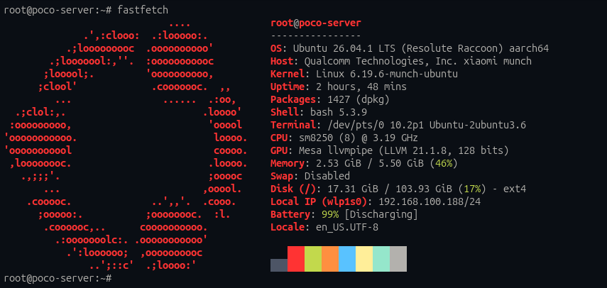
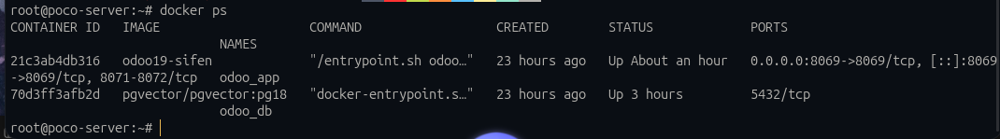

# BareDroid

BareDroid turns Android smartphones into native Linux home servers. Its main goal is to reuse capable, energy-efficient phones as always-on machines for self-hosted services, Docker containers, storage, automation and other home-lab workloads.

This is a full Linux environment running directly on the phone: no chroot, Termux, PRoot, container-based Linux distribution or Android compatibility layer is required. The current supported target is the Xiaomi POCO F4 / Redmi K40S (`munch`) with a Qualcomm Snapdragon 870.

The current reference system boots Ubuntu ARM64 natively from the phone's UFS storage using a Linux Mainline 6.19.6 kernel. Android is still used as the bootloader environment, but it is not used as a runtime layer: the Linux kernel starts `systemd` as PID 1 and mounts the Linux root filesystem directly.

> **Status:** Experimental. The documented and tested target is POCO F4 (`munch`). Flashing boot images can make a phone unbootable and can erase user data. Read the recovery and backup documentation before continuing.

## A full Linux home server on a phone

The reference installation boots Ubuntu 26.04 ARM64 with Linux Mainline 6.19.6, native `systemd`, direct access to the phone's CPU, memory and UFS storage, and standard Linux server tooling.



*A native Ubuntu ARM64 userspace running on the POCO F4 with Linux Mainline, systemd and an ext4 root filesystem.*

Docker runs directly on this Linux environment, allowing the phone to host conventional ARM64 services and application stacks. The example below shows running Odoo and PostgreSQL with PGVector containers.



*Docker containers running natively on BareDroid as home-server workloads.*

## What works in the current reference build

| Area | Current status |
| --- | --- |
| Device | Xiaomi POCO F4 / Redmi K40S (`munch`) |
| SoC | Qualcomm Snapdragon 870 / SM8250 |
| Kernel | Linux Mainline 6.19.6, custom `munch` device tree |
| Userspace | Ubuntu 26.04 ARM64 minimal server |
| Init | Native `systemd` |
| Containers | Docker Engine with native ARM64 containers |
| Wi-Fi | QCA6390 through the Mainline `ath11k_pci` driver |
| Recovery network | USB Gadget Ethernet, normally `172.16.42.1/24` |
| Boot model | Android A/B slots; Mainline is installed in slot B |
| Display profile | Headless server; display power management is device-specific |

The project does not currently promise support for other Xiaomi or Qualcomm devices. A similar SoC is not enough: the bootloader identifiers, memory map, regulators, display, storage layout and firmware requirements all differ between devices.

## Quick start

For the safest documented route, use a [published release](https://github.com/Rubencsku/BareDroid/releases) and follow [the release installation guide](docs/installation.md). The short version is:

1. Confirm that the phone is really `munch` and that its bootloader is unlocked.
2. Back up critical partitions, especially radio calibration and the original slot B images.
3. Prepare an Ubuntu ARM64 root filesystem on the userdata partition.
4. Verify the release checksums.
5. Flash `boot_b` and `vendor_boot_b`, erase only the slot-B DTBO as documented, select slot B and boot.
6. Connect through the USB recovery network and complete the first-boot configuration.

The release images contain the boot chain, kernel, device tree and kernel modules. They do **not** currently contain a complete Ubuntu root filesystem. See [Root filesystem preparation](docs/rootfs.md) before flashing.

## Build from source

The repository contains the device tree, initramfs source, packaging tools and configuration files. The Linux kernel source, cross-toolchain and generated images are intentionally not stored in Git. The current build flow therefore requires an additional source/toolchain setup described in [Building](docs/building.md).

The build scripts are useful but are not yet a fully self-contained clean-clone build system. In particular, the kernel source must contain the `munch` DTS and its corresponding DTB Makefile entries, and the Mainline initramfs must be assembled before boot images are packaged.

## Documentation

- [Installation from a release](docs/installation.md)
- [Root filesystem preparation](docs/rootfs.md)
- [Building the kernel and boot images](docs/building.md)
- [Boot architecture](docs/architecture.md)
- [Recovery, backups and rollback](docs/recovery.md)
- [Troubleshooting](docs/troubleshooting.md)
- [Hardware, support status and limitations](docs/hardware.md)
- [Release notes for v1.0.2-munch](docs/releases/v1.0.2-munch.md)
- [Release notes for v1.0.1-munch](docs/releases/v1.0.1-munch.md)
- [Release notes for v1.0.0-munch](docs/releases/v1.0.0-munch.md)
- [Legacy Debian and UEFI work](docs/legacy/README.md)
- [Contributing](CONTRIBUTING.md)
- [Security notes](SECURITY.md)

The original long-form tutorial is retained as a practical entry point in [TUTORIAL.md](TUTORIAL.md), but the topic-specific documents above are the source of truth.

## Repository layout

```text
.
├── configs/                         # Target-side services and configuration examples
├── docs/                            # User and developer documentation
├── dts/                             # POCO F4 / munch device tree source
├── firmware/                        # Device firmware files; check redistribution terms
├── initramfs/                       # Early userspace scripts
├── scripts/                         # Host and target helper scripts
├── setup_files/                     # Example systemd/network files
├── toolchains/setup_env.sh          # Cross-compilation environment loader
├── mkbootimg.py                     # Android boot image packaging utility
└── unpack_bootimg.py                # Android boot image inspection utility
```

Generated images, backups, kernel source and toolchains are excluded by `.gitignore`. Do not commit personal partition backups, Wi-Fi configuration, SSH keys or root filesystem images.

## Security warning

Do not use shared or default passwords on a networked phone. Configure your own user, password and SSH keys while preparing the root filesystem. The recovery initramfs exposes a root shell over the USB gadget network; treat the USB cable as privileged physical access.

The repository contains firmware and imported utilities with their own licensing requirements. There is not yet one unified project license for every file; see [the licensing notes](docs/licensing.md) before redistributing modified images or firmware.

## Contributing

Bug reports are most useful when they include the exact device variant, bootloader state, release or commit, fastboot output, kernel command line and relevant logs. See [CONTRIBUTING.md](CONTRIBUTING.md) and [SECURITY.md](SECURITY.md) before opening an issue.
